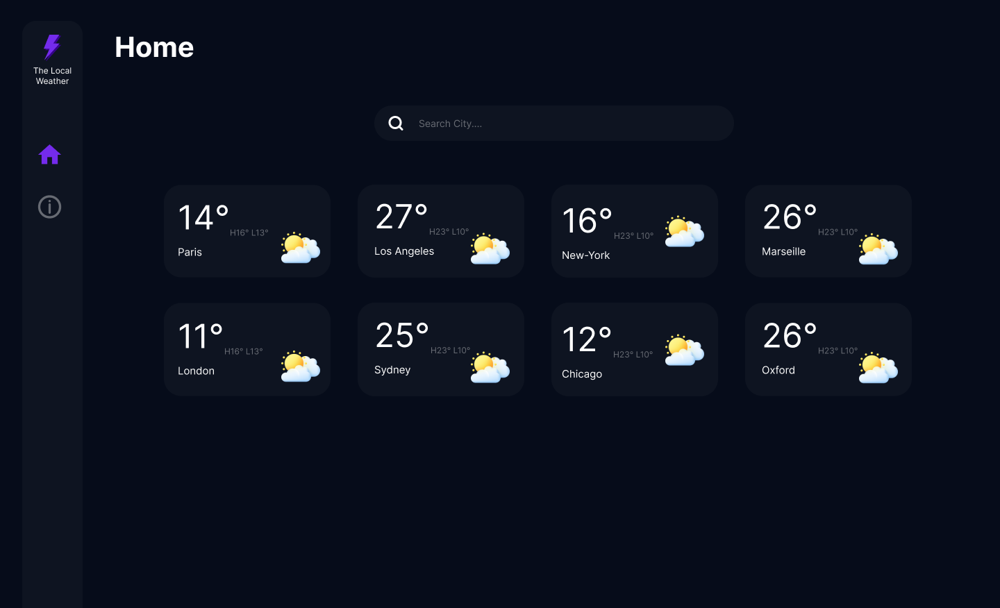
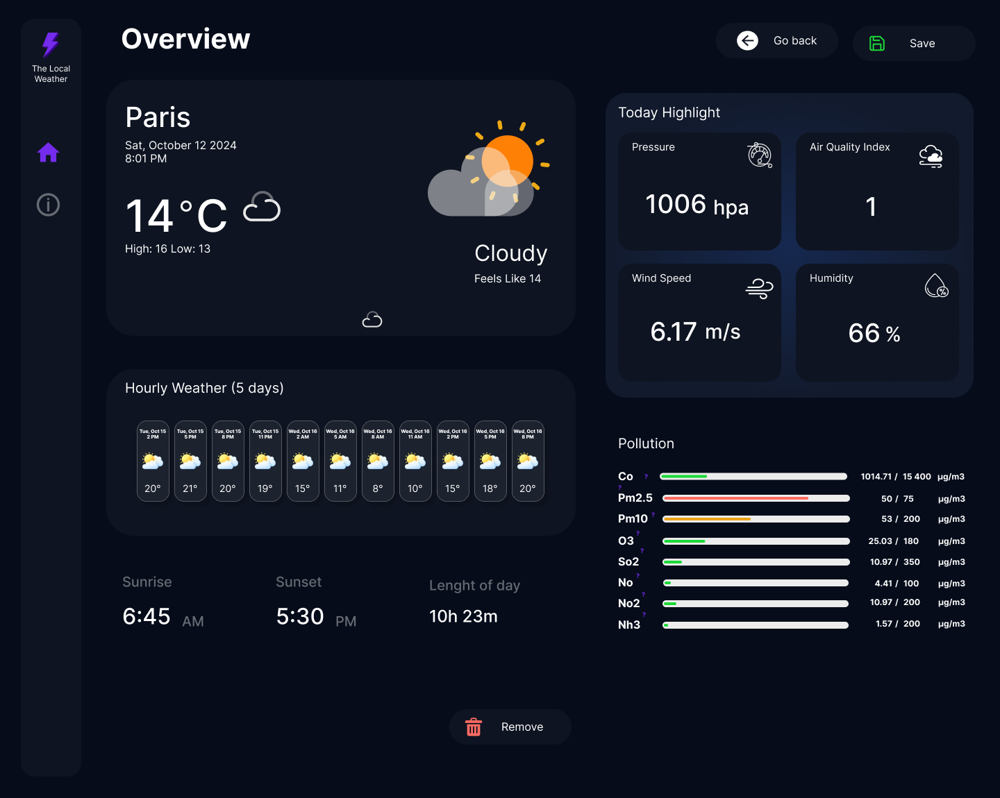

# 🌤️ The Local Weather - Vue.js Frontend 🌍

📍 **A modern weather app built with Vue 3, Pinia, OpenWeatherMap API, and Mapbox.**

---

## 🌐 **Live Demo**

🚀 Try it live: https://the-local-weather-v2.netlify.app/

---



---

## 🚀 **Project Overview**

The Local Weather is an interactive and dynamic weather dashboard that provides **real-time weather updates, air quality data, and location search powered by Mapbox**. Built with **clean code, API best practices, and a seamless user experience**.

---

## 🎯 **Features**

✔ **Real-time weather updates** with OpenWeatherMap API  
✔ **Location search with Mapbox API** (Find any city instantly)  
✔ **Favorite cities** (Save your preferred locations)  
✔ **Air quality monitoring** (Get pollution levels in real-time)  
✔ **Responsive design** (Fully optimized for mobile & desktop)

---

## 🛠️ **Tech Stack**

- **Frontend:** Vue 3, TypeScript, Pinia, Vite
- **APIs:** OpenWeatherMap, Mapbox
- **State Management:** Pinia

---

## 📸 **UI Preview**

### 🌙 **Dark Mode**



🔗 **Figma Prototype:** [Click to View](https://www.figma.com/proto/GncBoddXftzsEaMx7eS1aj/The-Local-Weather?node-id=4017-268&p=f&t=hl4LjcGNUlnNbnva-1&scaling=min-zoom&content-scaling=fixed&page-id=0%3A1)

---

## 🔧 **Installation & Setup**

To run this project locally, follow these steps:

### 1️⃣ **Clone the Repository**

```sh
git clone https://github.com/kadiax/the-local-weather.git
cd the-local-weather
```

### 2️⃣ **Install Dependencies**

```sh
npm install
```

### 3️⃣ **Add API Keys**

```sh
VITE_MAP_BOX_API_KEY=your_mapbox_api_key
VITE_OPEN_WEATHER_MAP_API_KEY=your_openweathermap_api_key
```

### 4️⃣ **Start the Development Server**

```sh
npm run dev
```

The app will be live at: http://localhost:5173/ 🎉

## ✨ **Best Practices Implemented**

- ✅ Efficient API Calls using Promise.all() for parallel fetching.
- ✅ Debouncing in search to reduce API calls & improve performance.
- ✅ Error handling with try/catch and proper user feedback.
- ✅ TypeScript support for API response safety.

## 👨‍💻 **Contact**

- 📧 Email: kadia.toure.pro@example.com
- 💼 LinkedIn: https://www.linkedin.com/in/kadiatoure
- 🐙 GitHub: https://github.com/Kadiax
